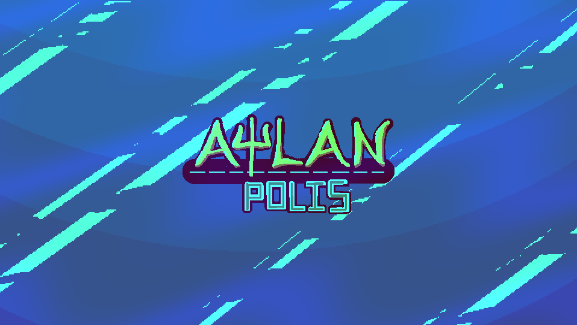
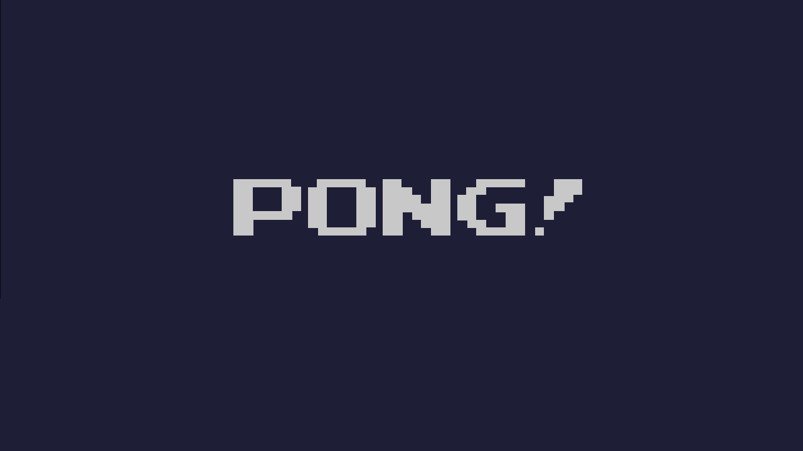

# my-games
This repository list all games made by myself, link for download and source code (not all)

## Index
1. [List by date](#List-by-date)
2. [List by name](#List-by-name)
3. [Showcase video link](#Showcase-video-link)

## List by date
- 12/10/2022 - Py-pong - [source](sources/Py-pong.zip)
- 15/04/2023 - Pipipi-Pizza - [Itch.io](https://kentaugust.itch.io/pipipi-pizza) - [source](sources/Pipipi-Pizza.zip)
- 07/08/2023 - Atlanpolis - [Itch.io](https://kentaugust.itch.io/atlanpolis) - [source](sources/Atlanpolis.zip)

## List by name
- Atlanpolis - 07/08/2023 - [Itch.io](https://kentaugust.itch.io/atlanpolis) - [source](sources/Atlanpolis.zip)
- Pipipi-Pizza - 15/04/2023 - [Itch.io](https://kentaugust.itch.io/pipipi-pizza) - [source](sources/Pipipi-Pizza.zip)
- Py-pong - 12/10/2022 - [source](sources/Py-pong.zip)

## Showcase video link
Newest to oldest

    

        
    

    

        
    

    

         
    

